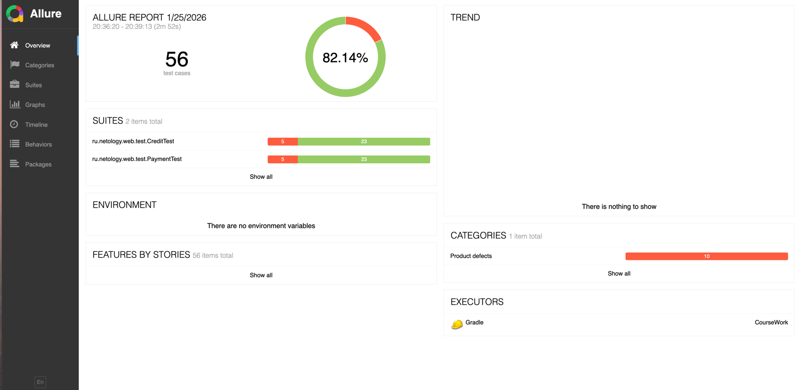
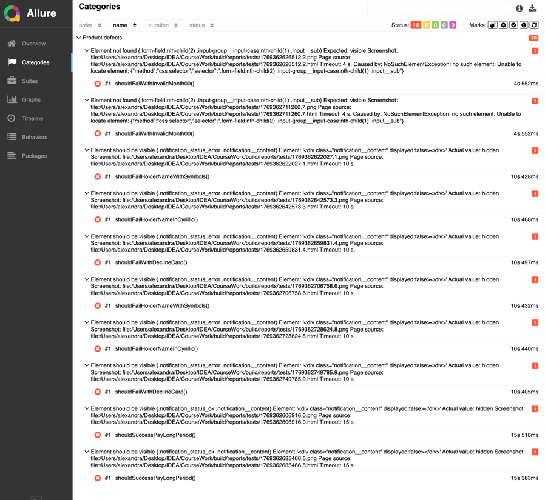
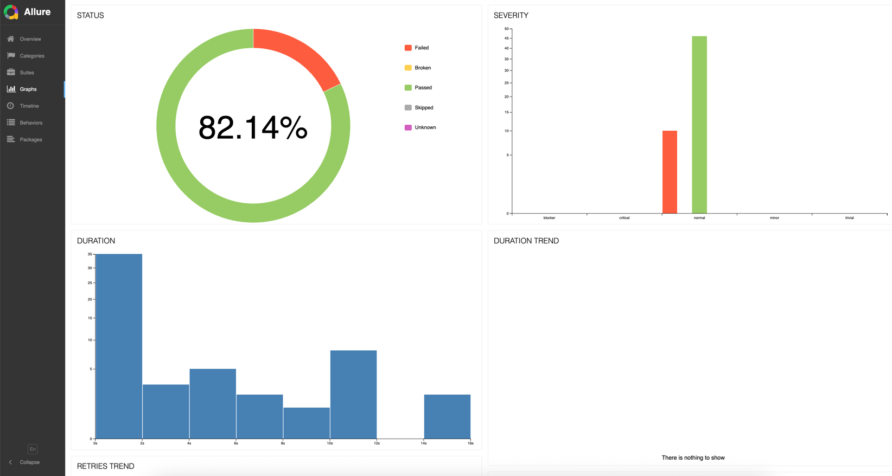
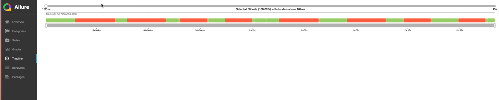

# Отчет о проведенном тестировании 

## 1. Краткое описание

Тестирование веб-интерфейса приложения покупки тура двумя способами: по карте и в кредит. 

Приложение сохраняет информацию о проведенных операциях в СУБД и интегрируется с банковским сервисом.

# 2. Тестирование
Всего автоматизировано 56 тест кейсов (по 28 тестов для каждого способа оплаты).
 
Из них по результатам тестирования оказалось по 23 успешных и по 5 неуспешных.

## Общие рекомендации

1. Добавить мгновенную валидацию для поля "Владелец". 
Проблема: на данный момент на сервер поступает много некорректных данных.
Решение:
Ввести следующие требования к заполнению поля.
   - Допустимые символы: только латинские буквы (A‑Z, a‑z).
   - Запрещены:
        - кириллица (А‑Я, а‑я);
        - цифры (0‑9);
        - спецсимволы (@, #, $, %, & и т. п.);
        - подчёркивания
   - Ограничение по длине. Например от 2 до 30 символов с сообщением при неверном вводе: "Имя не может быть короче/длиннее ## символов"

2. Конкретизировать сообщение о неверном заполнении поля.
Например, вместо общей фразы "Неверный формат" написать конкретное требование к заполнению.
    